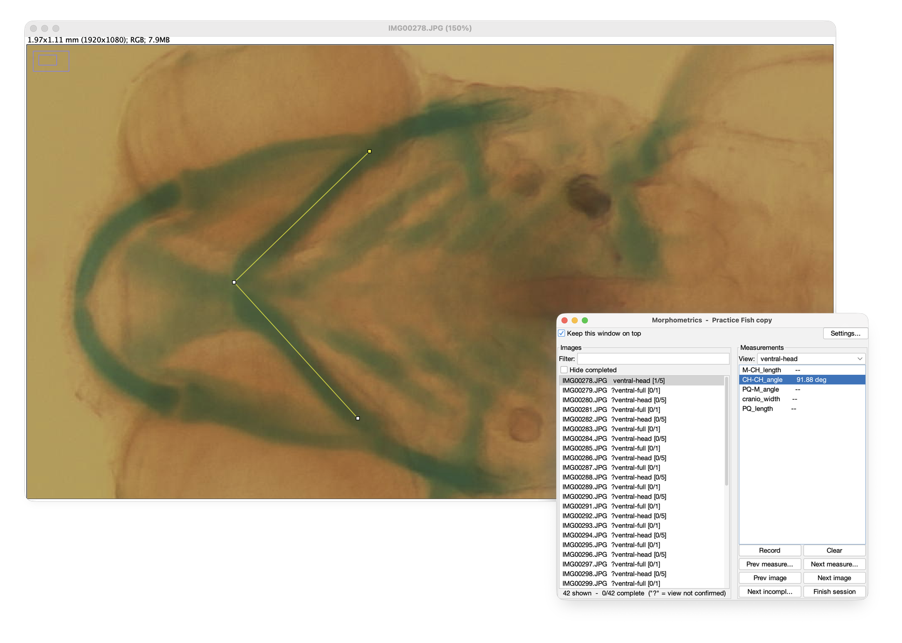

# Morphometrics Helper for Fiji

A Fiji script for taking manual length and angle measurements across a folder
of images quickly and consistently. For each image, the helper places a line or
angle for every measurement you have defined; you drag it into place and click
**Record**, and the value goes straight into a CSV file. The selection behind
every value is saved too, so any measurement can be checked or redone later.

It was originally written for zebrafish larval morphometrics (craniofacial
cartilage, head and body measurements), but nothing in it is specific to fish:
the views, measurements and scales all come from a plain-text config file, so
it can be used for any set of images you measure by hand.

## Assumptions

- **One folder per batch of images.** The config, results and saved selections
  all live in that folder.
- **Images were taken in a (mostly) repeating sequence of views.** For example,
  each fish photographed ventrally at 4x, then ventrally at 2x, then laterally
  at 2x. Sorted by file name, the images follow that cycle, and the helper uses
  it to predict each image's view. When the sequence breaks (a missed or extra
  shot), you correct that one image and the predictions after it follow on.
- **Each view has a fixed magnification**, so one scale per view is enough.
- **Subjects sit in a similar place in the frame each time.** Measurement start
  positions and zoom are remembered per view, so the more consistent the
  framing, the less adjusting you do.

## Installation

1. Install [Fiji](https://fiji.sc) if you don't already have it.
2. Download [`Morphometrics_Helper.groovy`](https://github.com/timrankin/Fiji-Morphometrics-Helper/raw/main/Morphometrics_Helper.groovy).
3. Copy it into Fiji's `plugins` folder
   ([where to find it](https://imagej.net/imagej-wiki-static/Installing_3rd_party_plugins)).
   On macOS the `plugins` folder is inside the Fiji folder, or inside
   `Fiji.app` on older installs (right-click `Fiji.app` > **Show Package
   Contents**).
4. Restart Fiji, or use **Help > Refresh Menus**.

It then appears as **Morphometrics Helper** at the very bottom of the
**Plugins** menu, below all the submenus.

## Usage

1. Run **Plugins > Morphometrics Helper** and choose your image folder.
2. If the folder has no `morphometrics_config.txt`, the helper offers to create
   one from a template and opens it for editing. Set your views, their order
   and the measurements for each, then save and click **OK**. See
   [`examples/morphometrics_config.txt`](examples/morphometrics_config.txt)
   for a worked example with every option explained.
3. If a view has no scale yet, the **Settings** window opens. Click
   **Measure scale bar**, draw a line along the scale bar in an image of that
   view, click **Use drawn line**, enter the bar's real length, and **Save**.
4. Pick a measurement, drag its line or angle into place, and click **Record**.

In the image list, `[3/5]` shows progress and a `?` marks a view that is only
predicted. Recording a measurement confirms the view; if a prediction is wrong,
change it with the **View** selector first.

**Settings** (top right of the helper window) sets each view's scale and where
each measurement's line or angle first appears. To set a start position, select
the measurement, move its selection on the image to where it usually belongs,
and click **Use selection on image**. Changing a scale after recording offers
to recalculate the existing lengths.

**Zoom memory:** each **Record** also remembers the zoom, visible area and
window size, and restores them the next time you select that measurement on an
image of the same view. Set `zoom_memory = view` or `off` in the config to
change this.

## Files it creates

All in the image folder, and saved after every **Record**, so you can stop and
pick up where you left off:

| File | Contents |
| --- | --- |
| `measurements_long.csv` | One row per measurement: `Folder, Image, View, Structure, Type, Value`. Lengths are in the view's unit, angles in degrees. |
| `RoiSets/<image>_RoiSet.zip` | The selections behind each value, which open in Fiji's ROI Manager. |
| `image_views.csv` | The confirmed view for each image. |
| `zoom_state.csv` | Remembered zoom and window framing. Delete it to start over. |

## Feedback and bug reports

Please use [GitHub Issues](https://github.com/timrankin/Fiji-Morphometrics-Helper/issues)
for bug reports, questions and feature requests. For a bug, include your Fiji
version, your `morphometrics_config.txt`, and any error from Fiji's Console
(**Window > Console**).

## Citing

If you use Morphometrics Helper in published work, please cite it. The
**Cite this repository** button on the GitHub page gives the reference in APA
and BibTeX formats.

## License

[MIT](LICENSE). You are free to use, modify and share it; copies must keep the
copyright notice.
